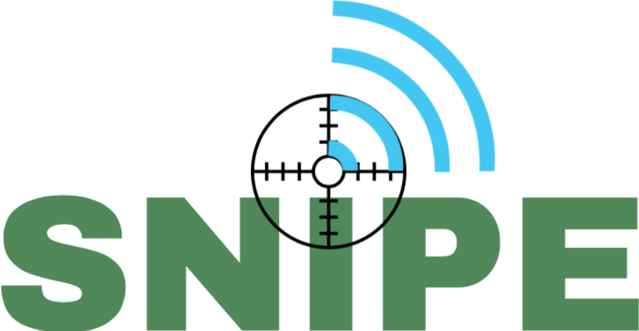

Snipe offers joint localization and range extensions for LPWANs. Although LPWAN systems such as Long Range (LoRa) are designed to achieve high communication range with low energy consumption, they suffer from fading in obstructed environments with dense multipath components, and their localization system is sub-par in terms of accuracy. Here, MIMO techniques are leveraged to achieve a higher signal-to-noise ratio at both the end device and the gateway while providing an opportunistic accurate radar-based system for localization with limited additional cost.
