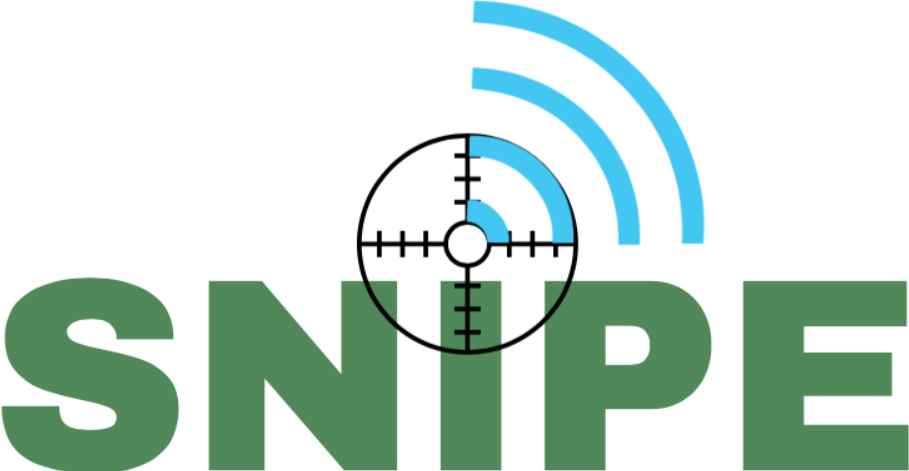
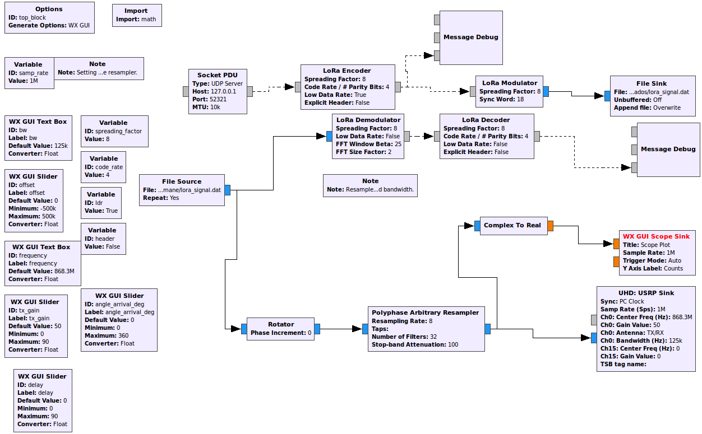
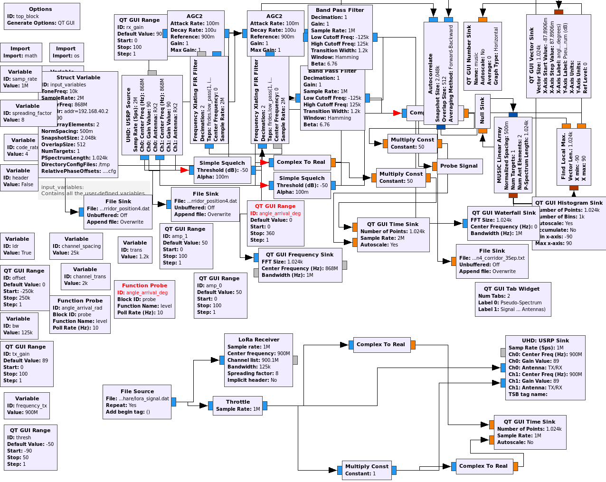

  

<<<<<<< HEAD

=======
>>>>>>> a50b8111c8b01b18d43e47e5f2492f8ec0249712

# SNIPE

## Introduction

Snipe offers joint localization and range extensions for LPWANs. Although LPWAN systems such as Long Range (LoRa) are designed to achieve high communication range with low energy consumption, they suffer from fading in obstructed environments with dense multipath components, and their localization system is sub-par in terms of accuracy. Here, MIMO techniques are leveraged to achieve a higher signal-to-noise ratio at both the end device and the gateway while providing an opportunistic accurate radar-based system for localization with limited additional cost.

## Installation

To use the system, the following dependecies should be installed:

* UHD >= 3.10.1.0
* GNU Radio 3.7.12.0
* gr-doa, gr-lora, gr-blocks, gr-pyqt
* QT4
* QWT 6.1.0

The system was tested for the follwing linux distributions:

* Fedora 26
* Ubuntu 14.04
* Ubuntu 16.04

## System Structure Description

### End Device

## Gateway

## Setup

Both the end device and the proposed MIMO gateway are built as custom software-defined radio systems using GnuRadio and Ettus Research USRP [B210](https://www.ettus.com/all-products/ub210-kit/) software-defined radio on laptops with 32GB RAM and a 2.70GHz i7-4800MQ processor.
The MIMO gateway is equipped with a 2-element ULA ([VERT 900MHz](https://www.ettus.com/all-products/vert900/)) for beamforming and a similar ULA for AoA estimation and coherent combining, while the end device has only one antenna for transmission and another one for reception.
Two channels were established between the gateway and the end device: the uplink on the 900 MHz frequency and the downlink on the 868MHz frequency. A band-pass filter from [GPIO Labs](https://www.tindie.com/products/gpio/869-mhz-filter-4-mhz-bandwidth/) with a bandwidth of 4MHz for the 869MHz frequency that covers the band of interest is used to filter out-of-band interference.
