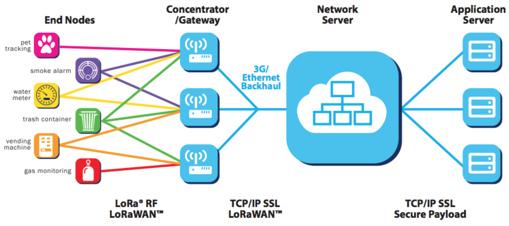
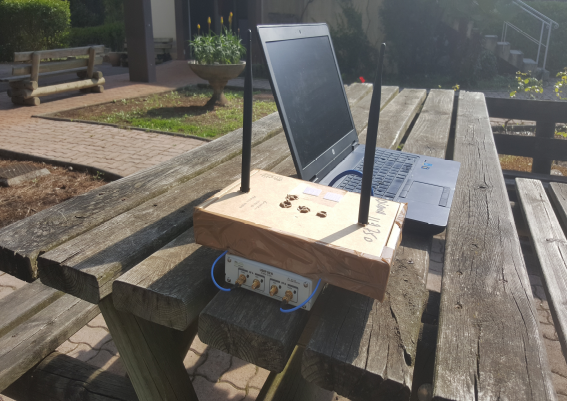
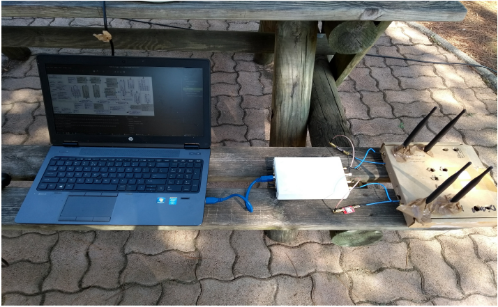
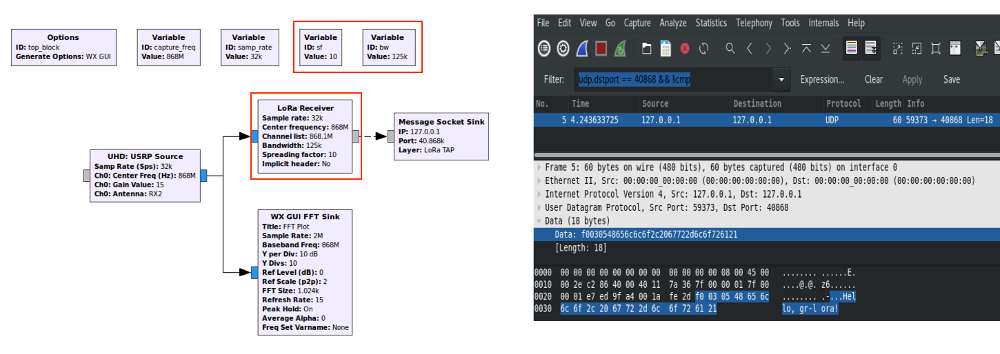
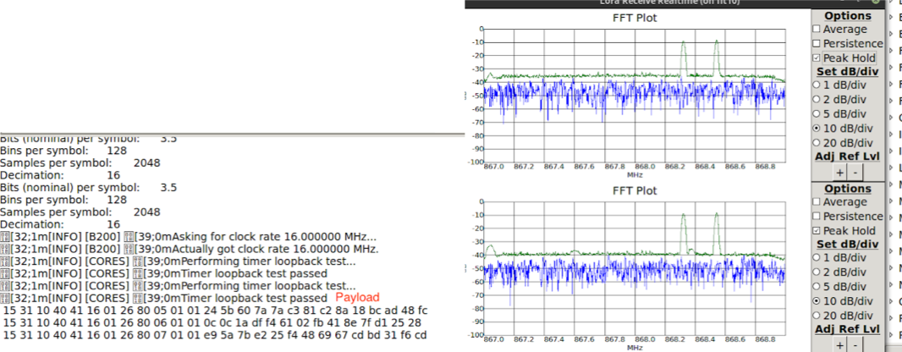

  

# SNIPE

## Introduction

Snipe offers joint localization and range extensions for LPWANs. Although LPWAN systems such as Long Range [(LoRa)](http://lora-alliance.org) are designed to achieve high communication range with low energy consumption, they suffer from fading in obstructed environments with dense multipath components, and their localization system is sub-par in terms of accuracy. Here, MIMO techniques are leveraged to achieve a higher signal-to-noise ratio at both the end device and the gateway while providing an opportunistic accurate radar-based system for localization with limited additional cost.

## Installation

To use the system, the following dependecies should be installed:

* UHD >= 3.10.1.0
* GNU Radio 3.7.12.0
* gr-doa, gr-lora, gr-blocks, gr-pyqt
* QT4
* QWT 6.1.0

The system was tested for the follwing linux distributions:

* Fedora 26
* Ubuntu 14.04
* Ubuntu 16.04

## General Desctiption of LoRa networks
The **LoRa** network is a star-of-stars topology, which includes different types of components: the end devices that are typically sensors or actuators, the gateways that represent the “core” of the network, the network server, and the application server [3].

* The **end devices** can communicate with several gateways using LoRa with LoRaWAN (single hop connection) by sending LoRa packets.

* The **gateways** receive and forward messages from end-devices (uplink communication) or from network server (for downlink communication) over a backhaul interface with a higher throughput (Ethernet or 4G). There are two types of gateways: commercial gateway developed by research companies and SDR (Software Defined Radio) gateway consisting of an USRP ( Universal Software Radio Peripheral).

* For **uplink** communication, the network server accepts connections from multiple gateways and routes messages from nodes to the right Application Server. It is also responsible to interpret the data sent by these devices to remove duplicate messages from different servers. So we can say that at the network server side, a first decryption of payload is computed. For downlink communication, the network server selects the best gateway to forward downlink messages to end-device.   

* The **application Server** decrypts the data from the network server. At the Application server side, a second decryption step is done, and the data that comes from the device is finally shown.

## System Structure Description
In our work we only operate at the edge (Gateways and End-devices)

### End Device

## Gateway

## Setup

Both the end device and the proposed MIMO gateway are built as custom software-defined radio systems using GnuRadio and Ettus Research USRP [B210](https://www.ettus.com/all-products/ub210-kit/) software-defined radio on laptops with 32GB RAM and a 2.70GHz i7-4800MQ processor.
The MIMO gateway is equipped with a 2-element ULA ([VERT 900MHz](https://www.ettus.com/all-products/vert900/)) for beamforming and a similar ULA for AoA estimation and coherent combining, while the end device has only one antenna for transmission and another one for reception.
Two channels were established between the gateway and the end device: the uplink on the 900 MHz frequency and the downlink on the 868MHz frequency. A band-pass filter from [GPIO Labs](https://www.tindie.com/products/gpio/869-mhz-filter-4-mhz-bandwidth/) with a bandwidth of 4MHz for the 869MHz frequency that covers the band of interest is used to filter out-of-band interference.

   

** End device ** -- The end-device is equipped with one antenna for transmission and one for reception. GNURadio flowgraph replays the signal captured from a end-device and this is transmitted as the LoRa modulated signal to the gateway. At the same time, this flowgraph also receives the signal from the gateway. The SNR of the received signal is compared with and without beamforming cases. 

  

** Gateway ** -- The gateway is equipped with two antennas for reception and two antennas for transmission both placed with a distance of 17cm ($\lambda$/2). Note: While setting up the environment, we found that the receive antenna's placed in the front was hiding/blocking the transmit signal. So, it was necessary to separate the transmit and receive antennas to make them have line-of-sight(LOS). 
* **Reception** (Estimate the DoA) -- Based on the signal received from the end-device, we compute the angle of arrival using the MUSIC algorithm.
* **Transmission** (Beamforming based on DoA) -- Based on the DoA computed from the received signal, beamforming is performed by applying the phase difference of arrival to the signal of the second antenna. This is done by replaying the LoRa signal and when transmitting it using two antennas one of the IQ signals is multiplied by the PDOA.  

#### Signal

The exchanged signals have the following charecteristics:
* Spreading Factor: 10
* Message Type: Unconfirmed Data
* Power :  14 dB
* Channel :  Cyclic (868.3 868.5 868.7)
* Preamble :  10 symbols

## LoRa Packet Reception Block

In order to receive the LoRa modulated signals in the USRP we use [gr-lora](https://github.com/rpp0/gr-lora) a open source OOT GNURadio module to receive and decode them.We used the open-source project and tried to use it with GNURadio and USRPs. This gr-lora project aims to provide a collection of GNURadio blocks for receiving LoRa modulated radio messages using a Software Defined Radio (SDR) here in our case the USRPs (USRP B210 and USRP2).

We programmed a end device to send a constant “Hello ok” message every 60 secs and this signal is captured by the GNURadio with the flowgraph given in the figure below. The LoRa Receiver block highlighted in the figure, receives the LoRa modulated messages and decodes the payload given the parameters like Spreading Factor, Bandwidth, Channel frequency, and sampling rate. This block performs the demodulation and decoding of the message and the payload of the packet is printed to the terminal of the GNURadio. One more way of visualizing the payload of the packet is to redirect the output of the LoRa Receiver block to a "Message Socket Sink" which is used to view the messages in a Wireshark application. 

  
  

